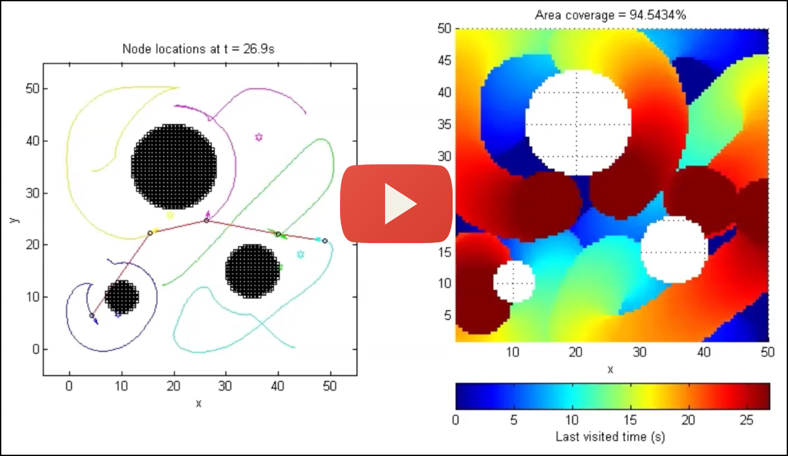

# Distributed Anti-Flocking Algorithms for Dynamic Coverage of Mobile Sensor Networks

If you find this [paper](http://ira.lib.polyu.edu.hk/handle/10397/60072) or code useful, we encourage you to cite the paper. BibTeX:

    @article{ganganath2016antiflocking,
    title={Distributed Anti-Flocking Algorithms for Dynamic Coverage of Mobile Sensor Networks},
    author={Nuwan Ganganath and Chi-Tsun Cheng and Chi K. Tse},
    journal={IEEE Transactions on Industrial Informatics},
    year={2016},
    volume={12},
    number={5},
    pages={1795--1805},
    publisher={IEEE}}
